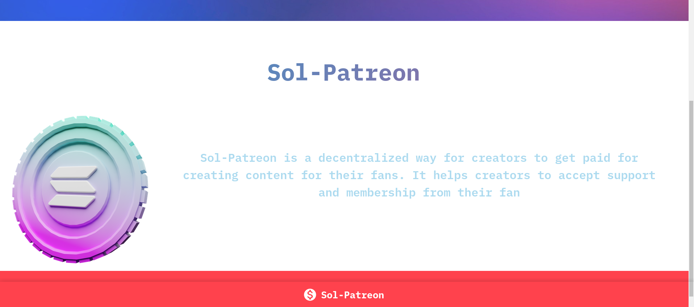

<b>Sol-Patreon</b> is a dApp (Decentralized application) that allows a decentralized way for creators to get paid for creating content for their fans. It helps creators to accept support and membership from their fans. It supports more than 5 wallets and each one of them provide a pretty easy way to do the transaction. To create your profile on the blockchain and to our platform, all you will need is a wallet and some SOL. If you dont have an wallet you can
create one from [here](https://phantom.app/)

## Why it was made:

The idea came when we were exploring projects particularly ones that gives support to creators that can connect to their fans in better way. The reason for us to create it on solana was for the most secure process for the creators to have their content, we choose Solana so to help them with what they deserve and make a platform easy and user-friendly so that we can support creators who has some content for which they can get paid. If you also want to get started about Solana, you can find the resources I used to create one dApp from [here](https://github.com/cdhiraj40/SolanaxLeetDroid/blob/master/RESOURCES.md).

## What it does :

This project "<b>Sol-Patreon/b>" provides builders, creators, and simply people who want to connect with their fans to create a profile to add their pay-based content in their profile section with a sol pay account and the ones who would like to donate would simply do without creating their account contribute to the creator. This makes transactions easy and effective. It lets user to connect with their creator via a simple UI. To donate any creator
you have to connect to your wallet. The dApp provides more than 5 wallets and once you are connected you can create your profile and add into blockchain under 10 seconds. Yes its that fast!(Read more about Solana from [here](https://solana.com/news/getting-started-with-solana-development). if you still face any issues feel free to create an issue, I would love to help. 

### Screenshots

  
### Demo Video

## 👇 Prerequisites

Before installation, please make sure you have already installed the following tools: 
The project is using [Anchor Framework](https://project-serum.github.io/anchor/getting-started/introduction.html) to build smart contracts.
- [Anchor Framework](https://project-serum.github.io/anchor/getting-started/installation.html)

some other optional prerequisites if you are interested in contributing.
- [Git](https://git-scm.com/downloads)

## 🛠️ Installation Steps

1. Fork the project
2. Clone the project
3. Create a new branch (`git checkout -b new-feature`)
4. One can find smart contract in the ``program-rust/programs/sol-patreon/src/`` directory.
5. Make your changes and build the program by running ``anchor build``
6. Once built, connect to any [cluster](https://docs.solana.com/cli/choose-a-cluster) and run the deploy command which you got at the end of build command or just run ``anchor deploy``.
7. Once all the appropriate changes are done in the files (` git add . `) 
Note: Do check the files that you are adding to the staging area by ``git status``
8. Add changes to reflect the changes made (`git commit -m 'commit message'`)
9. Push to the branch (` git push `)

## 👨‍💻 Contributing

- Any contributions you make are **greatly appreciated**.

### Bug / Feature Request

If you find a bug in the dApp/website, kindly open an issue [here]
(https://github.com/cdhiraj40/Sol-Patreon/issues/new) by
including a proper description about the bug and the expected result. Similarly, We would be glad to hear about new features to add in the project, kindly follow same procedure for it too.

## 🛡️ License

Sol-Patreon is licensed under the MIT License - see the [`LICENSE`](LICENSE) file for more information.
